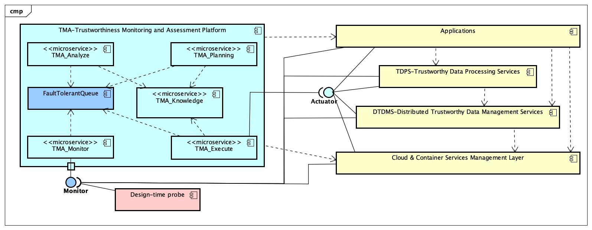
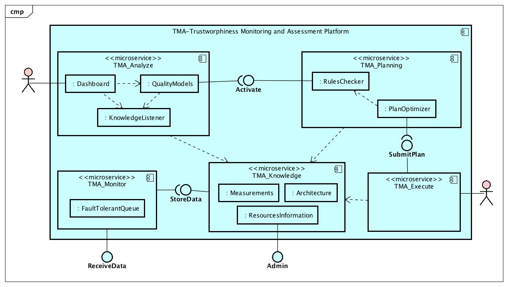

#  Trustworthiness Monitoring &amp; Assessment Framework

To implement the [**ATMOSPHERE**](http://www.atmosphere-eubrazil.eu) methodology, it is necessary to define a modular and scalable architecture able to integrate the components to be developed throughout the project.

The [figure below](architecture/diagrams/TMA-Platform_Architecture.jpg) presents a high-level architecture of the solution in the form of an UML Component Diagram, including the trustworthiness monitoring and assessment platform key components and the way they will interact with the remaining layers of the ecosystem.

*High-level architecture for the ATMOSPHERE solution for trustworthiness monitoring and assessment.*

The applications deployed in the [**ATMOSPHERE**](http://www.atmosphere-eubrazil.eu) cloud platform should be embedded in containers that will be managed by the *Cloud & Container Services Management Layer*. 
Also, those applications may rely on *TDPS* and *DTDMS* layers for data processing and management.

The `TMA_Monitor` component provides a generic interface that can be used by the probes installed in the different layers of the system to send data about the collected measurements and events. 
These data are then stored in the `TMA_Knowledge` component, where it will be available to be used in by the `TMA_Analyze`, `TMA_Planning`, and `TMA_Execute` components.

The `TMA_Planning` exposes an interface that allow the `TMA_Analyze` component to notify it about the need for adaptations. 
Similarly, the `TMA_Execute` component provides an interface through which the `TMA_Planning` component can submit an adaptation plan to be performed.
Finally, the components of the remaining ecosystem layers provide an interface with predefined adaptations that can be activated by the `TMA_Execute` component.

## TMA Platform Architecture

The platform architecture is presented in the [figure below](architecture/diagrams/TMA-Platform_Detailed_Architecture_Actors.jpg). 
In practice, the platform is a special-purpose [**ATMOSPHERE**](http://www.atmosphere-eubrazil.eu) application, also deployed over the container services layer, and internally designed in a microservices architecture, where each component represents one `MAPE-K` step.

* Architecture and interfaces of the trustworthiness platform.*

The [`TMA_Monitor`](#tma_monitor) component follows a passive strategy (push mode) in which the other layers provide trustworthiness-related information through the `ReceiveData` RESTful interface. 
In every layer of the [**ATMOSPHERE**](http://www.atmosphere-eubrazil.eu) platform, the deployed probes are responsible for the active monitoring tasks. 
Every information the probes push through the `ReceiveData` is enqueued in a `FaultTolerantQueue` to assure that it will be handled in a reliable way and will be stored in the `TMA_Knowledge` component.
 
The platform also receives the results of the **design-time** assessment tasks, in which the performance and scalability requirements are not so stringent. 
The tools used to perform these assessment tasks are able to push data through the `ReceiveData` interface. 
When this not possible, adapters are used to transform the output of the tools and submit it to the platform. 
In some cases these results may have to be added manually, through a supporting tool.

The [`TMA_Knowledge`](#tma_knowledge) component stores measurements data, and stores and manages information about the application architecture, resources and assets available and their possible adaptations.

The [`TMA_Analyze`](#tma_analyze) component is responsible for continuously listening to the `TMA_Knowledge` microservice, calculate the trustworthiness scores and, if such scores fall below a threshold, the `TMA_Planning` microservice is activated through`ActivatePlanning`. 
It provides a `Dashboard` to the user, which allows him to analyse information at runtime and adjust the parameters of the quality models and thresholds used.

The [`TMA_Planning`](#tma_planning) microservice is responsible for executing the verification rules that will produce a set of adaptations that will be consolidated in an “adaptation plan” to achieve the required goals, or to recover the desired levels of trustworthiness.

Finally, the [`TMA_Execute`](#tma_execute) microservice runs the adaptation plan received through `SubmitPlan` interface using the deployed actuators on the target layers.

## TMA Platform Components
More details can be found in the documentation of each of these components.

### TMA\_Monitor
[Main repository available here.](https://github.com/nmsa/tma-framework-m)

### TMA\_Analyze
[Main repository available here.](https://github.com/nmsa/tma-framework-a)

### TMA\_Planning
[Main repository available here.](https://github.com/nmsa/tma-framework-p)

### TMA\_Execute
[Main repository available here.](https://github.com/nmsa/tma-framework-e)

### TMA\_Knowledge
[Main repository available here.](https://github.com/nmsa/tma-framework-k)

