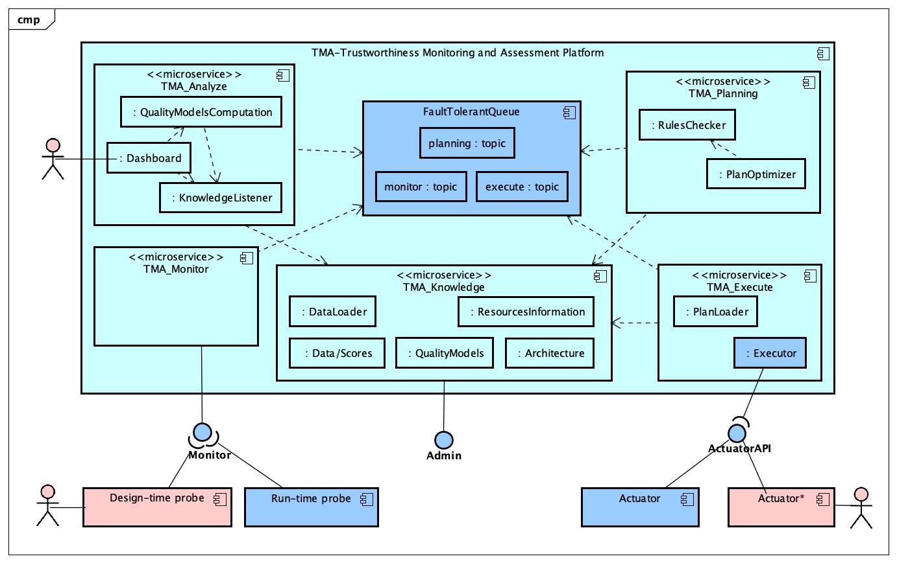
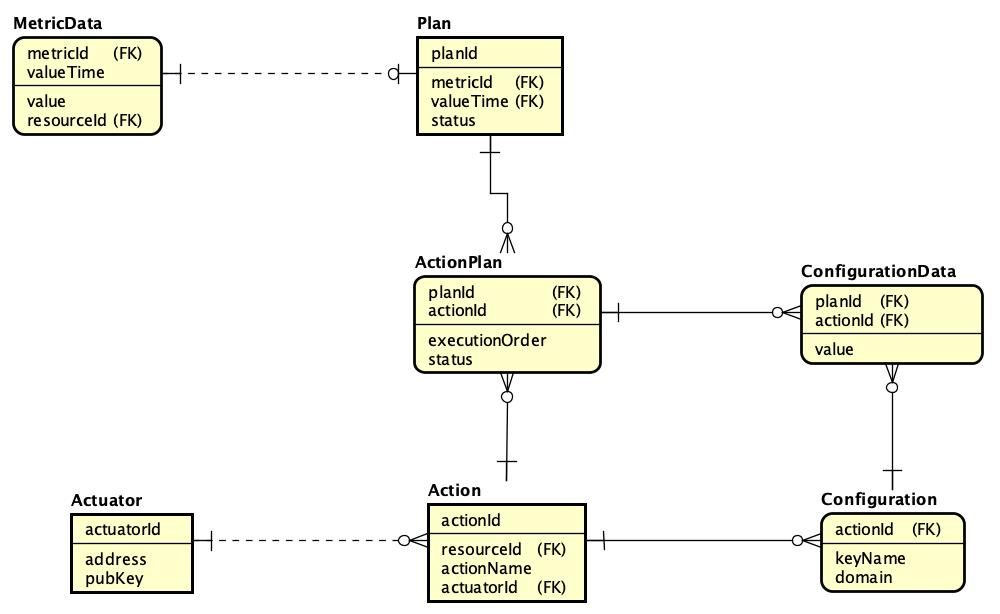

#  Trustworthiness Monitoring &amp; Assessment Framework

The communication between the components from the `MAPE-K` is done mainly by the `FaultTolerantQueue`, according to the [figure below](../architecture/diagrams/TMA-Platform_Detailed_Architecture.jpg).

* Architecture and interfaces of the trustworthiness platform.*

The [`TMA_Analyze`](#tma_analyze) component is responsible for continuously listening to the `TMA_Knowledge` microservice, calculate the trustworthiness scores and, store them on the database. An item is added to the `planning` queue from the `FaultTolerantQueue` in order to the [`TMA_Planning`](#tma_planning) starts checking the rules. The format of the message is a [JSON](interface/atmosphere_tma-p_schema.json) according to the image below:

* Format of the JSON message to be read by the TMA_Planning component*

The `metricId` indicates that a new value for the corresponding metric was calculated and stored in the database, in the moment stored on `timestamp`.

The [`TMA_Planning`](#tma_planning) microservice is responsible for executing the verification rules that will produce a set of adaptations that will be consolidated in an "adaptation plan" to achieve the required goals, or to recover the desired levels of trustworthiness. This is done by continuously polling the messages from the `planning` queue. If an adaptation is needed, an "adaptation plan" is stored in the database with the set of actions. 

* Conceptual Data Model used by the Planning component.*

An adaptation plan is stored in the `Plan` table, and it is always related to the `MetricData` that dispatched the adapation. The set of actions and the order of execution is stored in the `ActionPlan` table, and it is related to an `Action`, which will be performed by the correspondent `Actuator`. In case the actions need parameters, their values are stored in the `ConfigurationData` table.

The communication of [`TMA_Planning`](#tma_planning) is done by the `execute` queue, which will receive a [JSON](interface/atmosphere_tma-e_schema.json) message with the plan identifier.

* Format of the JSON message to be read by the TMA_Execute component*

Finally, the [`TMA_Execute`](#tma_execute) microservice runs the adaptation plan using the deployed actuators on the target layers. This component is continuously polling the messages from the `execute` queue. When a plan is added, the list of actions is obtained from the [`TMA_Knowledge`](#tma_knowledge), with the order of execution and the parameters values.

(nmsa: CHECK IF THIS CONTENT SHOULD REPLACE THE SECTION FROM THE MAIN PAGE)

(REVIEW THE LINKS TO THE SUB-MODULES)
